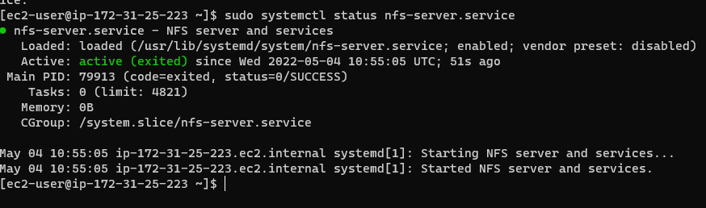
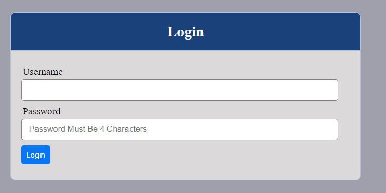
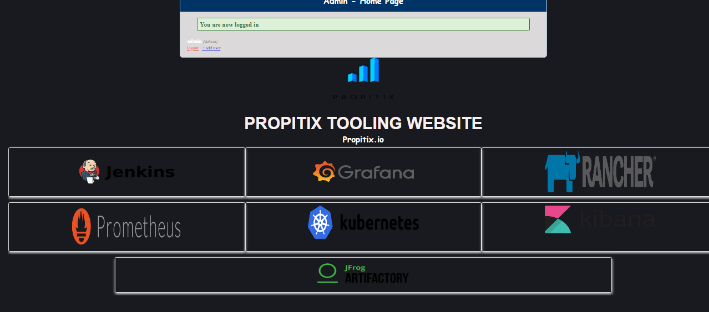

# DEVOPS TOOLING WEBSITE
## PREPARE NFS SERVER
> Spin up a new EC2 instance with RHEL Linux 8 Operating System, log into the server, create 3 10G EBS volumes and attache them to to instance. Configure 3 LVM Volumes, lv-apps, lv-logs, lv-ops.
```
gdisk /dev/xvdf
sudo gdisk /dev/xvdf
sudo gdisk /dev/xvdg
sudo gdisk /dev/xvdh
sudo yum install -y lvm2
sudo lvmscan
sudo lvmdiskscan
sudo pvcreate /dev/xvdf1
sudo pvcreate /dev/xvdg1
sudo pvcreate /dev/xvdh1
sudo lvcreate webdata-vg /dev/xvdf1 /dev/xvdg1 /dev/xvdh1
sudo vgcreate webdata-vg /dev/xvdf1 /dev/xvdg1 /dev/xvdh1
sudo lvcreate -n lv-apps -L 9G webdata-vg
sudo lvcreate -n lv-logs -L 9G webdata-vg
sudo lvcreate -n lv-opt -L 9G webdata-vg
```

> Format the volumes into xfs file system, create a mount point and then mount them.
```
sudo mkfs -t xfs /dev/webdata-vg/lv-apps
sudo mkfs -t xfs /dev/webdata-vg/lv-logs
sudo mkfs -t xfs /dev/webdata-vg/lv-opt
sudo mkdir /mnt/apps
sudo mkdir /mnt/logs
sudo mkdir /mnt/opt
sudo mount /dev/webdata-vg/lv-apps /mnt/apps
sudo mount /dev/webdata-vg/lv-logs /mnt/logs
sudo mount /dev/webdata-vg/lv-opt /mnt/opt
```

>Install NFS server, configure it to start on reboot and make sure it is u and running
```
sudo yum -y update
sudo yum install nfs-utils -y
sudo systemctl start nfs-server.service
sudo systemctl enable nfs-server.service
sudo systemctl status nfs-server.service
```


> Export the mounts for webservers’ subnet cidr to connect as clients. Before this we need to change the owner of the apps,opt, and logs directory and then modify the permissions such that our webservers can have read, write, and execute permissions.
```
sudo chown -R nobody: /mnt/apps
sudo chown -R nobody: /mnt/logs
sudo chown -R nobody: /mnt/opt
sudo chmod -R 777 /mnt/apps
sudo chmod -R 777 /mnt/logs
sudo chmod -R 777 /mnt/opt
sudo systemctl restart nfs-server.service
```
> Configure access to NFS for clients within the same subnetand then export it.
```
sudo vi /etc/exports
/mnt/apps <Subnet-CIDR>(rw,sync,no_all_squash,no_root_squash)
/mnt/logs <Subnet-CIDR>(rw,sync,no_all_squash,no_root_squash)
/mnt/opt <Subnet-CIDR>(rw,sync,no_all_squash,no_root_squash)
sudo exportfs -arv
```
> Check which port is used by NFS and open it using Security Groups.

```rpcinfo -p | grep nfs```
> Open tcp port 111, udp port 111, tcp port 2049 and udp port 2049 in your NFS security group such that it can be accessed by your web clients.

## CONFIGURE THE DATABASE SERVER
> Install MySQL server,
Create a database and name it tooling,
Create a database user and name it webaccess,
Grant permission to webaccess user on tooling database to do anything only from the webservers subnet cidr.
```
sudo apt update -y
sudo apt install mysql-server -y
create database tooling;
grant all privileges on tooling.* to 'webaccess'@'172.31.16.0/20';
flush privileges
```
## PREPARE THE WEB SERVERS
> We need to make sure that our Web Servers can serve the same content from shared storage solutions, in our case – NFS Server and MySQL database.
> Mount the Logical Volume lv-apps to the folder where Apache stores files to be served to the users (/var/www). For this we are going to do the following 3 steps on our 3 webservers.

1. Configure NFS client
2. Deploy a Tooling application to our Web Servers into a shared NFS folder
3. Configure the Web Servers to work with a single MySQL database
```
sudo yum update -y
sudo yum install nfs-utils nfs4-acl-tools -y
sudo mkdir /var/www
sudo mount -t nfs -o rw,nosuid 172.31.25.223:/mnt/apps /var/www
sudo vi /etc/fstab
> Install Remi repository
sudo yum install httpd -y
sudo dnf install https://dl.fedoraproject.org/pub/epel/epel-release-latest-8.noarch.rpm
sudo dnf install dnf-utils http://rpms.remirepo.net/enterprise/remi-release-8.rpm
sudo dnf module reset php
sudo dnf module enable php:remi-7.4
sudo dnf install php php-opcache php-gd php-curl php-mysqlnd
sudo systemctl start php-fpm
sudo systemctl enable php-fpm
setsebool -P httpd_execmem 1

git clone https://github.com/ebonlo/tooling.git
sudo cp -R html/. /var/www/html
sudo setenforce 0
sudo vi /etc/sysconfig/selinux
sudo systemctl start httpd
sudo systemctl enable httpd
sudo systemctl status httpd
```




> Update the website’s configuration to connect to the database and Apply tooling-db.sql script to your database.
```
vi /var/www/html/functions.php
mysql -h <databse-private-ip> -u <db-username> -p <db-pasword> < tooling-db.sql
```
> Open the website in your browser http://<Web-Server-Public-IP-Address-or-Public-DNS-Name>/index.php and make sure you can login into the websute with a user.
> You should get the following result




